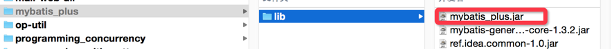
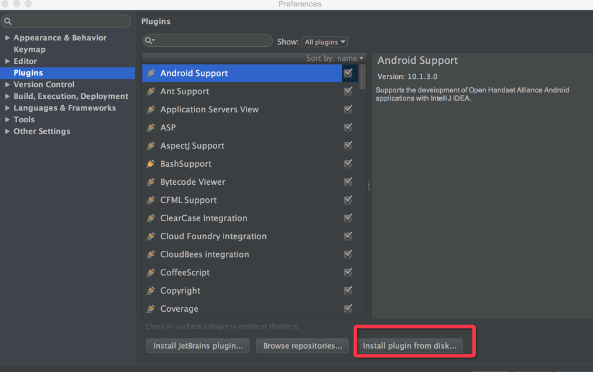

### 准备工具

* jd-gui

* Better-zip
 
* 从https://plugins.jetbrains.com/plugin/7293?pr=idea查找使用自己机器上idea版本的插件。

### 破解

1.将下载的插件解压缩。



2.编写破解代码

```
	public class Test {
	
	    @Test
	    public void test() {
	        ClassPool classPool = new ClassPool();
	        try {
	            classPool.insertClassPath("/Users/liuwenqiang/Downloads/mybatis_plus/lib/mybatis_plus.jar");
	            CtClass ctClass = classPool.get("com.seventh7.mybatis.util.JavaUtils");
	            CtMethod ctMethod = ctClass.getDeclaredMethod("refValid"); // 获取方法
	            ctMethod.setBody(" return true;"); // 修改方法体
	            ctClass.writeFile();
	        } catch (NotFoundException e) {
	            e.printStackTrace();
	        } catch (CannotCompileException e) {
	            e.printStackTrace();
	        } catch (IOException e) {
	            e.printStackTrace();
	        }
	    }
	}
```

基本原理就是将mybatis_plus.jar 中 JavaUtils类的方法【refValid】方法体替换。

3.替换class文件

运行上面文件后会在当前工程目录生成com.seventh7.mybatis.util.JavaUtils.class文件。用better-zip打卡jar包，将该文件拖入覆盖同名文件。

### 安装

1.在idea中快捷键commad+,

2.如下图所示



3.导入刚才的jar包就可以了。


