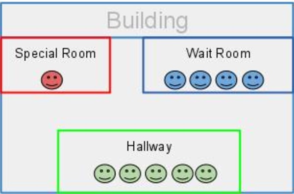
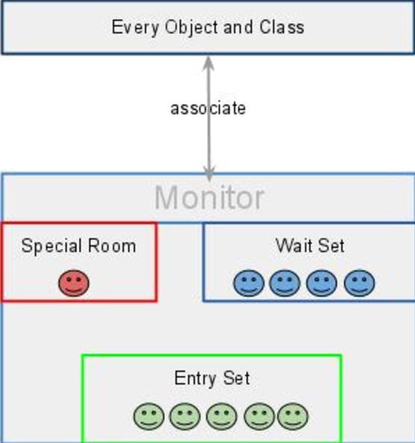

如果您在大学时进行了操作系统课程，您可能会记得，监视器是操作系统中同步的重要概念。它也用于Java同步。这个帖子用类比来解释“监视”的基本思想。

## 什么是监视器
监视器可以视为包含特殊房间的建筑物,特殊的房间一次只能由一个客户（线程）占用,房间通常包含一些数据和代码。



如果客户想要占用特殊的房间，他必须进入走廊（entry set）先等待。 调度程序将根据一些标准（例如FIFO）选择一个，如果他由于某种原因被暂停，他将被送到等候室，并计划在之后重新进入特别的房间。 如上图所示，该建筑有3间客房。



简而言之，监视器是监视线程访问特殊房间的设施。 它确保只有一个线程可以访问受保护的数据或代码。

## 在java中是如何实现的

在Java虚拟机中，每个对象和类都与监视器逻辑关联。为了实现监视器的互斥能力，锁（有时称为互斥）与每个对象和类相关联。这在操作系统书籍中被称为信号量，互斥是二进制信号量。

如果一个线程对某些数据加锁，那么没有其他人可以获得该锁，直到拥有该锁的线程释放它为止。在进行多线程编程时，如果我们需要一直写一个信号量，这是很不方便。幸运的是，我们不需要，因为JVM自动为我们做了。

要声明一个监视区域，意味着数据不能被多个线程访问，Java提供同步语句和同步方法。 一旦代码嵌入了synchronized关键字，它就是一个监视器区域。这些锁由JVM自动实现。

我们知道每个对象/类与一个监视器相关联，我认为每个对象都有一个监视器是很好的，因为每个对象可以有自己的关键部分，并能够监视线程序列。

为了能让不同线程协作，Java提供wait()和notify()来挂起一个线程，并分别唤醒另一个正在等待对象的线程。另外还有3个其他版本：

```
wait(long timeout, int nanos)
wait(long timeout) notified by other threads or notified by timeout. 
notify(all)
```

这些方法只能在synchronized语句或synchronized方法中调用。 原因是如果其中一个方法不需要互斥，则不需要在线程之间监视或协作，每个线程都可以自由地访问该方法。

[这里](http://www.programcreek.com/2009/02/notify-and-wait-example/)是一些同步代码示例。

参考

1.	[Thread synchronization](http://www.artima.com/insidejvm/ed2/threadsynch.html)
2.	[Locks and Synchronization](http://docs.oracle.com/javase/tutorial/essential/concurrency/locksync.html)
3.	[notify() vs notifyAll()](http://stackoverflow.com/questions/3807715/java-notify-vs-notifyall-possible-deadlock)

[原文地址](http://www.programcreek.com/2011/12/monitors-java-synchronization-mechanism/)