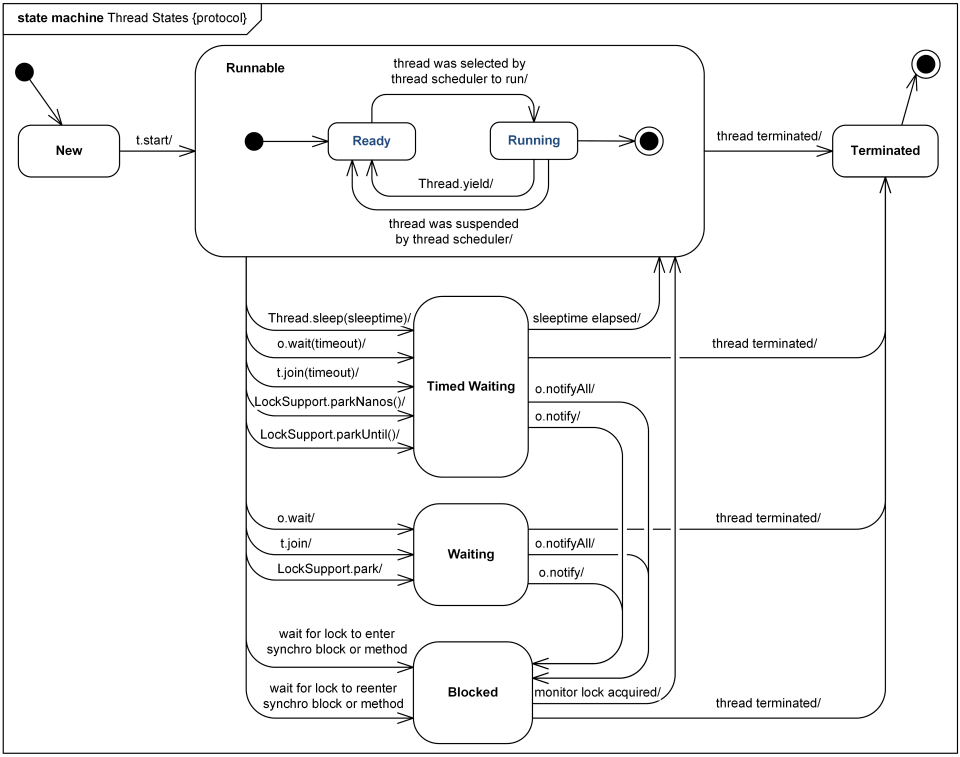

这是UML协议状态机图的一个例子，它显示了Java中Thread类的线程状态和线程生命周期;线程是一个轻量级的进程，是调度执行的最小单位,Java中的Thread类的实例可能处于以下状态之一：

- new
- runnable
- timed waiting
- waiting
- blocked
- terminated

这些状态是JVM向Java程序报告的Java虚拟机（JVM）状态。在任何给定的时间点，线程可能只处于一个状态。

**New** 这个是刚创建但是还没有启动的状态

在较低的操作系统（OS）级别，JVM的**Runnable**可以被认为是具有两个子状态的复合状态,当线程转换到可运行的JVM状态时，线程首先进入**Ready**的子状态，线程调度决定线程何时实际启动，继续或暂停。当暂停当前执行的线程以允许其他线程执行时，线程调度程序明确建议用Thread.yield()。

从JVM的角度看**Runnable**状态的线程是正在执行的线程，但实际上它可能正在从操作系统等待一些资源。

**Timed waiting**是指等待指定时间的线程状态。线程处于定时等待状态，因为在调用以下方法时指定了正的超时时间：

- Thread.sleep(sleeptime)
- Object.wait(timeout)
- Thread.join(timeout)
- LockSupport.parkNanos(timeout)
- LockSupport.parkUntil(timeout)

线程处于**Waiting**状态，因为调用下列方法之一而没有设置超时时间：

- Object.wait()
- Thread.join()
- LockSupport.park()

请注意，处于等待状态的线程正在等待另一个线程执行特定的操作。例如，在对象上调用Object.wait()的线程正在等待另一个线程在该对象上调用Object.notify()或Object.notifyAll()。调用Thread.join()的线程正在等待指定的线程终止。 这意味着等待状态可以作为与这些特定条件相对应的状态的复合状态。

当线程等待监视器锁进入同步块或同步方法，或者在调用Object.wait()之后重新进入同步块或同步方法时处于**Blocked**状态。

同步语句或方法为执行线程获取互斥锁，执行块或方法，然后释放锁。当执行线程拥有锁时，没有其他线程可以获得锁，并且因为等待锁而被阻塞。

当线程执行完run方法里面的代码时处于**Terminated**状态

[原文地址](http://www.uml-diagrams.org/examples/java-6-thread-state-machine-diagram-example.html)

译者注：

